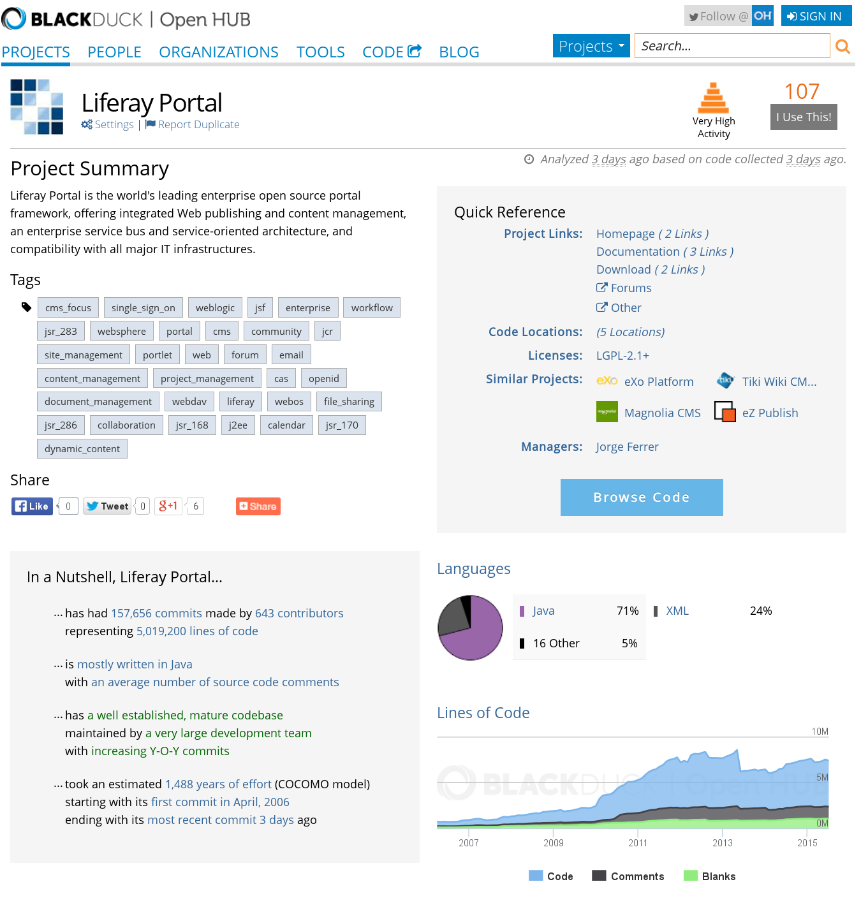
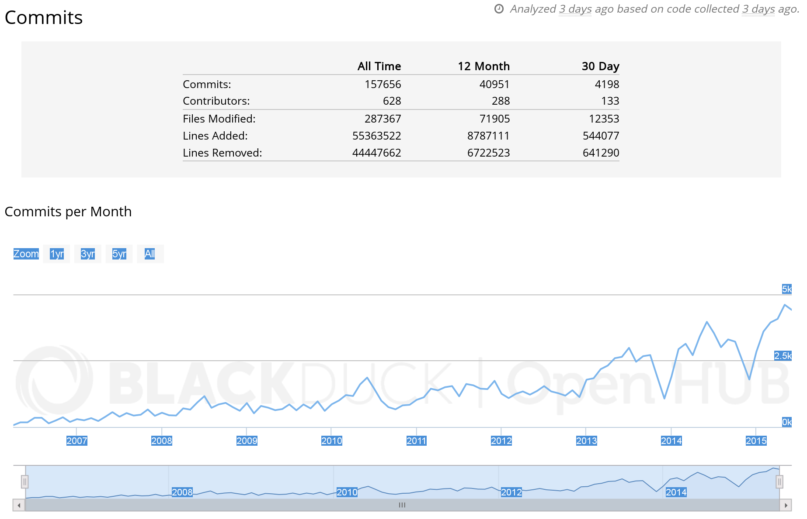
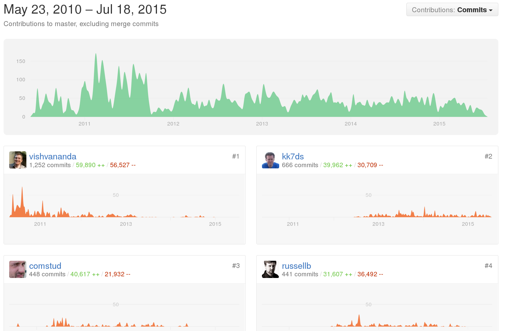
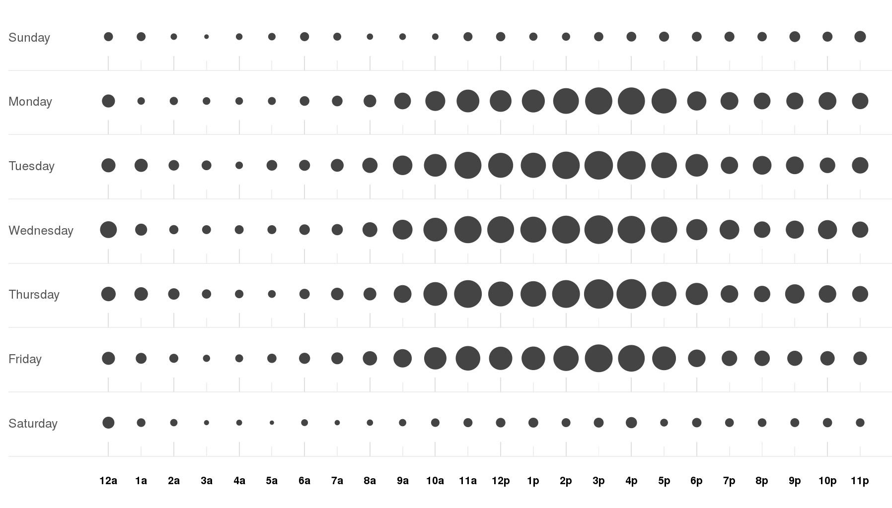
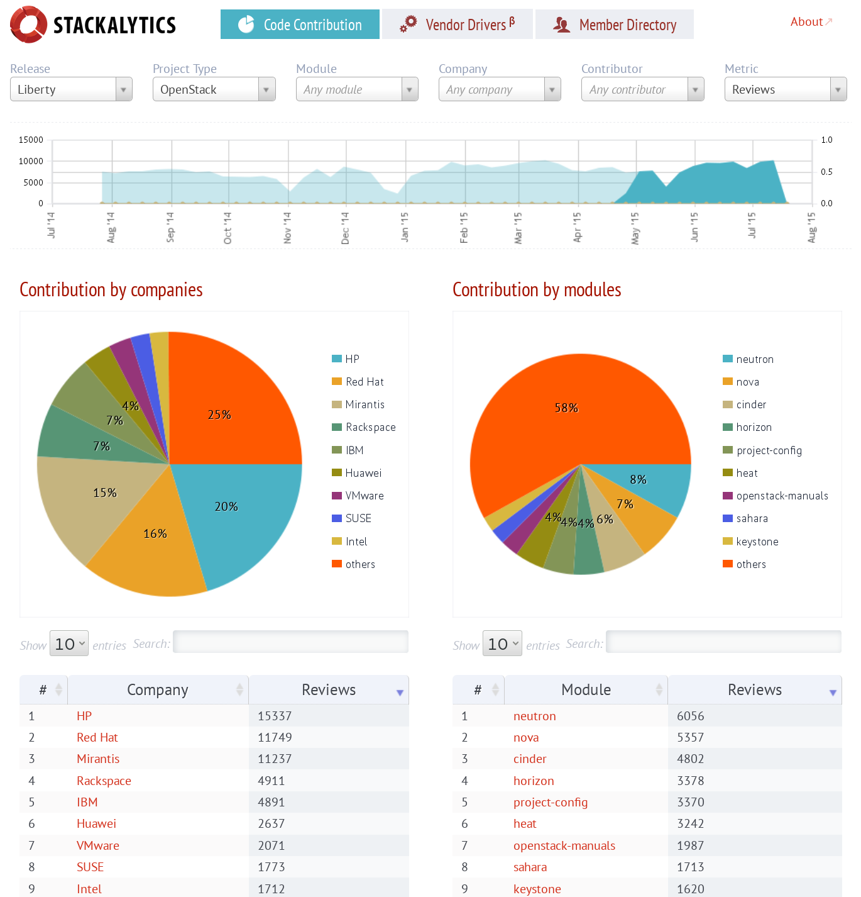
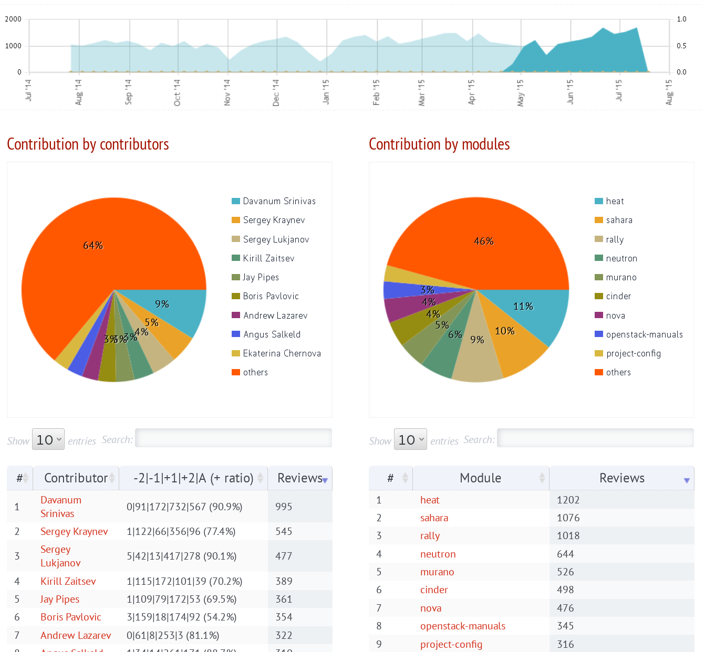

# Evaluation dashboards

There are several software products or services that provide dashboards useful for evaluation. Each of them have different characteristics, and are useful in different parts of the evaluation process, or for different areas of evaluation. In this chapter we introduce some of them.

## The Open Hub dashboard

[Open HUB](http://openhub.net), formerly known as Ohloh, is a website maintained by BlackDuck. Among other services, it provides a software development dashboard for a very large collection of projects (at least, tens of thousands of them).

All the information provided by Open HUB is based on the analysis of SCM. It includes both the analysis of the contents (licensing, lines of code, programming languages) and the metainformation (commits, committers, etc).

*Main page of the Open HUB dashboard for Liferay Portal, as of July 2015.*

The dashboard offers several views, each showing a different aspect of the project. The main page is a summary of the parameters of the project, and in some cases provides enough parameters for a basic assessment about its activity, and the size of the code produced. Then, there are specific panels showing analysis by programming language, and by lines of code, activity and developers.

*Commits panel of the Open HUB dashboard for Liferay Portal, as of July 2015.*

The main interest of Open HUB is probably the huge number of projects for which they offer information. It is very like that if you look for any even minimally known project, Open HUB maintains a dashboard for it.

The main problems with this dashboard lie on the lack of support for data sources other than the SCM, on its relative simplicity, and on the fact that being proprietary software, only they can improve and customize it.

## GitHub statistics

GitHub provides some statistics for the repositories it hosts. Most of it is based on the activity in the git repository, although it provides some basic data about issues and pull requests as well.

*Contributors panel of the GitHub dashboard for OpenStack Nova, as of July 2015*

Even when they don't use the term "dashboard", they provide a simple one. It includes information on contriutors and activity, with a focus on the historical evolution of contributions.

The dashboards provided by GitHub are intersting because, even being simple, they are available for all the repositories the site hosts. And they host most of the FOSS being developed these days. Therefore, as in the case of Open HUB, it is very likely that if you need some simple metrics for almost any project, you can find a repository in GitHub with it, and therefore a dashboard providing it.

On the other hand, some of the main drawbacks are that the metrics provided are just a few, and in general simple, that they don't provided aggregated metrics, for example at the level of a whole GitHub organization, and that they are proprietary software, meaning that only they can improve their dashboard.

## Stackalytics

[Stackalytics](http://mirantis.com) is a service provided by Mirantis to the OpenStack community. It is based on FOSS, and for that reason it has been considered by other communities to gather and visualize their development metrics.

*Main view of the Stackalytics dashboard for OpenStack, as of July 2015.*

The Stackalytics dashboard shows a summary the activity and the community of the project, including the evolution of several parameters over time, and the current shares of contribution for companies, subprojects and developers.

*View for the activity of Mirantis, Stackalytics dashboard for OpenStack, as of July 2015.*

Stackalytics is tailored to the specific needs of the OpenStack community. It provides information not only about commits in the git repositories, but also about tickets, code review and mail messages, making it a comprehensive tool that assists on the understanding of the OpenStack project. Being FOSS, the tool can be adapted to special needs, and is in fact being considered by other communities for providing a dashboard service to their developers.

In its current form, its main drawback is related to its main feature: bein specifically tailored to the needs and characteristics of OpenStack, it can be difficult to adapt to other projects.

## Grimoire Dashboard

