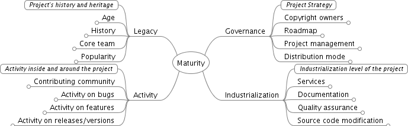
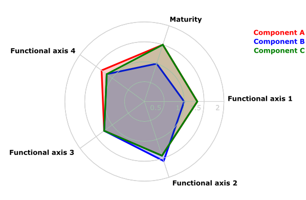

# Evaluation models

This chapter describes some of the evaluation models that can be used for FOSS projects. We will focus on quantitative models, since they are easier to apply and replicate, and probably, more useful. This does not mean that qualitative models are not important. But since they are more based on qualitative perception, they are very dependent on the expertise and familiarity of the expert performing the evaluation. Quantitative models try to be more independent from the person doing the analysis, but defining quantitative data that tries to capture the relevant aspects of the project being evaluated.

Of course, there are shadows in a continuum ranging from pure quantitative to pure qualitative. In fact, the models mentioned in this section may have some aspects which are at least partially qualitative.

## Basics of quantitative evaluation

Quantitative evaluation is based on the identification of quantitative parameters that can be significant, and the definition of measurement models for them.

Given the number of evaluation models that exist, [Stol and Ali Babar](#bib:stol-babar-comaprison-models) have proposed a  comparison framework to evaluate them. In order to do so, the most relevant evaluation models were identified. The result of this identification process, after screening around 550 research papers, is provided in following table, with 20 approaches. The column "Orig" shows if the initiative is the result of a research (R) or an industrial (I) effort. Models have been classified as industrial if they are associated to at least one company. The column "Method" indicates the completeness of the methodology, meaning that if all required activities, tasks, inputs and outputs are outlined, the assessment methodology offers a complete guide to evaluation. If a mere set of evaluation criteria are proposed, then the authors labeled the methodology as not complete.

| Name     | Year |  Orig | Method |
| -------- |:----:|:-----:|:------:| ------:|
| Capgemini Open Source Maturity Model | 2003 | I | Yes |
| Evaluation Framework for Open Source Software | 2004 | R | No |
| A Model for Comparative Assessment of Open Source Products | 2004 | R | Yes |
| Navica Open Source Maturity Model | 2004 | I | Yes |
| Woods and Guliani's OSMM | 2005 | I | No |
| Open Business Readiness Rating (OpenBRR) | 2005 | R/I | Yes |
| Atos Origin Method for Qualification and | 2006 | I | Yes |
| Selection of Open Source Software (QSOS) | 2006 | R | No |
| Evaluation Criteria for Free/Open Source Software Products | 2007 | R | No |
| A Quality Model for OSS Selection | 2007 | R | Yes | 
| Selection Process of Open Source Software | 2007 | R | Yes |
| Observatory for Innovation and Technological transfer on Open Source software (OITOS) | 2007 | R | No |
| Framework for OS Critical Systems Evaluation (FOCSE) | 2007 | R | No |
| Balanced Scorecards for OSS | 2007 | R | Yes |
| Open Business Quality Rating (OpenBQR) | 2007 | R | Yes |
| Evaluating OSS through Prototyping | 2008 | R | No |
| A Comprehensive Approach for Assessing Open Source Projects | 2008 | R | Yes |
| Software Quality Observatory for Open Source Software (SQO-OSS) | 2008 | R | No |
| An operational approach for selecting open source components in a software development project | 2008 | R | No |
| QualiPSo trustworthiness model OpenSource Maturity Model (OMM) | 2009 | R | No |

Of all these models, we have selected some that we describe in some more detail in the following sections.

## OpenBRR

The OpenBRR (Open Business Readiness Rating) is an evaluation method proposed in 2005 and sponsored most notably by Carnegie Mellon and some industrial partners (CodeZoo, SpikeSource and Intel) [The OpenBRR white paper](http://docencia.etsit.urjc.es/moodle/mod/resource/view.php?id=4343). The goal of this method is to provide an objective manner to assess community-driven projects, offering a final quantitative mark that is intended to provide a measure of its readiness to be deployed in a business environment.

Following figure provides an overview of the how OpenBRR should be applied. As can be seen, OpenBRR involves a multi-step evaluation process, that can be adjusted by the evaluator to adapt the assessment to the specific needs of the organization that wants to deploy the
software under study-

OpenBRR is based on gathering metrics and factual data on up to following ten categories:

* Functionality
* Usability
* Quality
* Security
* Performance
* Scalability
* Architecture
* Support
* Documentation
* Adoption
* Community
* Professionalism

For each category, a set of criteria and metrics are proposed. These inputs are then weighted and each of the above introduced categories are given a rating that ranges from 1 to 5. Then, depending on the final usage the software will be given, adopters may weight these categories, obtaining an overall rating of the project. Hence, not all categories are weighted equally, and for some scenarios a category may not be considered at all for the final rating (in that case, its weight factor would be 0%).

To help in the assessment, OpenBRR offers a [spreadsheet template](http://docencia.etsit.urjc.es/moodle/mod/resource/view.php?id=4350) that can be used in the evaluation process. Many of the input data in this model are to be obtained by external tools or from the Internet. As an example, the quality category considers the following inputs:

* Number of minor releases in past 12 months
* Number of point/patch releases in past 12 months
* Number of open bugs for the last 6 months
* Number of bugs fixed in last 6 months (compared to # of bugs opened)
* Number of P1/critical bugs opened
* Average bug age for P1 in last 6 months

These inputs are rated as well from 1 to 5, and the evaluator may then weight them in a posterior step.

[Udas et al.](#bib:udas-apples) discuss in a report how to apply OpenBRR in real environments based on their experience in the evaluation of Learning Management Systems. The 31 page report is very exhaustive and provides some general guidelines to be followed when using OpenBRR. It also gives an idea of how difficult and time-consuming it is.

The OpenBRR website provided a set of examples of use of the evaluation model. Of these, the most known assessed Moodle and Sakai, two well-known learning management systems that were widely used in industry and academic institutions. As they introduce the OpenBRR assessment process very well, we will show them here in detail. You can browse the [OpenBRR spreadsheet for Moodle](http://gsyc.es/~grex/evaluating/BRR_Worksheet_25Jul05_Moodle.sxc) and the [OpenBRR spreadsheet for Sakai](http://gsyc.es/~grex/evaluating/BRR_Worksheet_25Jul05_Sakai.sxc) for more details.

The first step in the process is to select and weigh the criteria to be use in the evaluation process. In the case of Moodle and Sakai, the evaluators chose to use the following:

| Rank | Category      |  Weight |
| ----:|:------------- | -------:|
|    1 | Functionality |   	 25% |
|    2 | Usability     |	 20% |
|    3 | Documentation |	 15% |
|    4 | Community     |     12% |
|    5 | Security      |	 10% |
|    6 | Support       |     10% |
|    7 | Adoption      |      8% |
| Total |              |    100% |

leaving out five criteria: Quality, Performance, Scalability, Architecture and Modularity.

In the following step, each criteria is evaluated on its own. As an example, for the evaluation of the functionality, a list of 27 standard functionality items (that include from discussion forums to surveys or automatic testing) are included, which have been obtained from the edutools.info on-line portal. Depending on the grade of its completeness, each functionality is scored and weighted from 1 to 3 as shown in the following table. Additional 8 extra functionalities (such as LaTeX support or the inclusion of video) are rated in the same fashion.

| Weight & Test Score Specification | Score | 
|:--------------------------------- | -----:|
| Very important                    |	3   |
| Somewhat important				|   2   |
| Not important						|   1   |

In order to obtain a total score for the functionality criteria, the total weights of the standard functionality items is summed up in W. Then the score for the assessed tool is obtained by adding all the scores, both from the standard and extended functionality, as T. Depending on the completeness of T related to W (in percentage), a final rating score is provided, using the cutoff values provided in following table.

| Rating Score Table | Percentage Cutoff | Score |
|:------------------ | -----------------:| -----:|
| Unacceptable		 |	     0%          |	1    |
| Poor				 |       65%	     |  2    |
| Acceptable		 | 	     80%         |	3    |
| Good				 |       90%         |	4    |
| Excellent			 |       96%	     |  5    |

In our case studies, Sakai obtains a 3 out of 5 (its percentage is 86.67%, as it has a total score of 52 out of a total weight of 60), while Moodle obtains 5 out of 5 (its percentage is 106.67% with a total score of 64 out of a a total weight of 60.

Once this is done with all evaluation criteria, the score of each of the criteria is introduced in a spreadsheet and the final score is calculated. It should be noted that when doing so the
previously defined weights are to be taken into consideration. For instance, the results of this step is provided in the following table for Moodle and Sakai. The total score of 4.19 for Moodle and of 3.23 for Sakai is finally obtained by summing up all the weighted scores for
each of the categories.

| Rank | Category | Moodle Unweighted | Sakai Unweighted | Weight | Moodle Weighted | Sakai Weighted | 
|:-- | --------:| -----------------:| ----------------:| ------:| ---------------:| --------:|
| 1  | Functionality |            5 |                3 |    25% |           1.25  |    0.75  |   
| 2  | Usability |                4 |                4 |    20% |           0.8   |    0.8   |   
| 8  | Quality |                  0 |                0 |     0% |           0     |    0     |   
| 5  | Security |               4.2 |              3.4 |    10% |           0.42  |    0.34  |   
| 9  | Performance |              0 |                0 |     0% |           0     |    0     |   
| 10 | Scalability |              0 |                0 |     0% |           0     |    0     |   
| 11 | Architecture |             0 |                0 |     0% |           0     |    0     |   
| 6  | Support |                  4 |              1.5 |    10% |           0.4   |    0.15  |   
| 3  | Documentation |          3.1 |              3.1 |    15% |           0.47  |    0.47  |   
| 7  | Adoption |               4.4 |              4.2 |     8% |           0.35  |    0.34  |   
| 4  | Community |              4.2 |              3.2 |    12% |           0.5   |    0.38  |   
| 12 | Professionalism |          0 |                0 |     0% |           0     |    0     |   

Although OpenBRR is one of the most known assessment models, it has not achieved to create a thriving community and currently it seems to have come to a halt.

## QSOS

QSOS (Qualification and Selection of Open Source software) is an assessment methodology proposed by ATOS Origin in 2004 and updated in 2013. It is composed of a formal method that describes a workflow to evaluate projects, a set of tools that help to apply the QSOS workflow and a community. The proposed process is shown in the figure below. It is divided in four iterative steps and is iterative in nature, meaning that it can be applied with different granularity levels, becoming more detailed in every iteration.

The first step is concerned with defining the evaluation criteria in three axes: type of software, type of license and type of community. The type of software axis is composed by two additional criteria: a maturity analysis and a functional coverage analysis. The next figure shows a diagram with the specific items that are to be considered when assessing the maturity of a project. These items can be obtained in general from any free software project.

The second item for the type of software is related to the functionality of the project and depends on the software domain.

The type of license criterion evaluates the software licenses for three aspects: if the license is a copyleft license, if copyleft is only bounded to the module level and if the license allows to add restrictions.

Finally, the type of community criterion addresses the :

* A single developer working on his own on the project
* A group of developers, without formal processes
* A developer organization with formalized and respected software life cycle, roles and a meritocratic structure
* A legal entity (such as a foundation) that manages the community and acts as legal umbrella for the project
* A commercial entity: a company that employs some of the core developers and tries to obtain revenues from the development of the project

The second step involves the evaluation of the projects by obtaining data and measures from the project; raw evaluations are the output of this step. For each of the criteria, a score between 0 and 2 is given. The following table provides the scoring rule in the case of the assessment of functionality:

| Score | Description |
|:----- |:----------- |
| 0     | Functionality not covered | 
| 1     | Functionality partially covered |
| 2     | Functionality fully covered |

The results of the second step are then weighted depending on the context and the requirements under which the software will be used; specifically this is done by setting weights and filters
in advance. So while in the first step, for instance all functionality may be assessed independently of its importance for its adoption and deployment, in this step the degree of relevance of each functional aspect will be translated into a weighting value. In the case of functionality, this means that functionalities may be considered required, optional or not required.

The final step is the selection of the most relevant software solution, by comparing the result obtained by several candidate software projects. QSOS offers two different modes of selection: strict and loose selection. Within the loose selection process, all software projects under assessment are evaluated for all criteria, and obtains a final rating. Within the strict selection process, as soon as a software does not comply with a relevant criteria of the evaluator, it is eliminated from the evaluation process. So, for instance, if a software does not require the required functionalities it is not further considered. It should be noted that with the strict selection procedure, and depending on the demands of the user, it may happen that no software meets the conditions.

The final result of QSOS can be shown and compared graphically by several means. One of them is using a radar format as shown in the next figure.

The QSOS framework offers a set of tools that help users follow the assessment process. Among them, there is an editor (the Freemind well-known mind-mapping tool) the create evaluation templates. These templates can then be used for the evaluation of a project using a Firefox extension or a stand-alone application. QSOS offers a web backend service where templates and evaluations can be made public and shared. Finally, O3S is a web-based tool that allows to manipulate evaluations, perform comparisons and export them in various formats.

Finally, the QSOS is an open project by itself, offering support to users and acting as a repository of templates and evaluations in several languages.

## SQO-OSS
	
SQO-OSS is a quality evaluation framework for FLOSS projects.

## Open Source Maturity Model

by QualiPSo

## OpenBQR

## Qualoss

	
## The Polarsys Maturity Model

## The Apache Maturity Model

## OpenStack Tags

