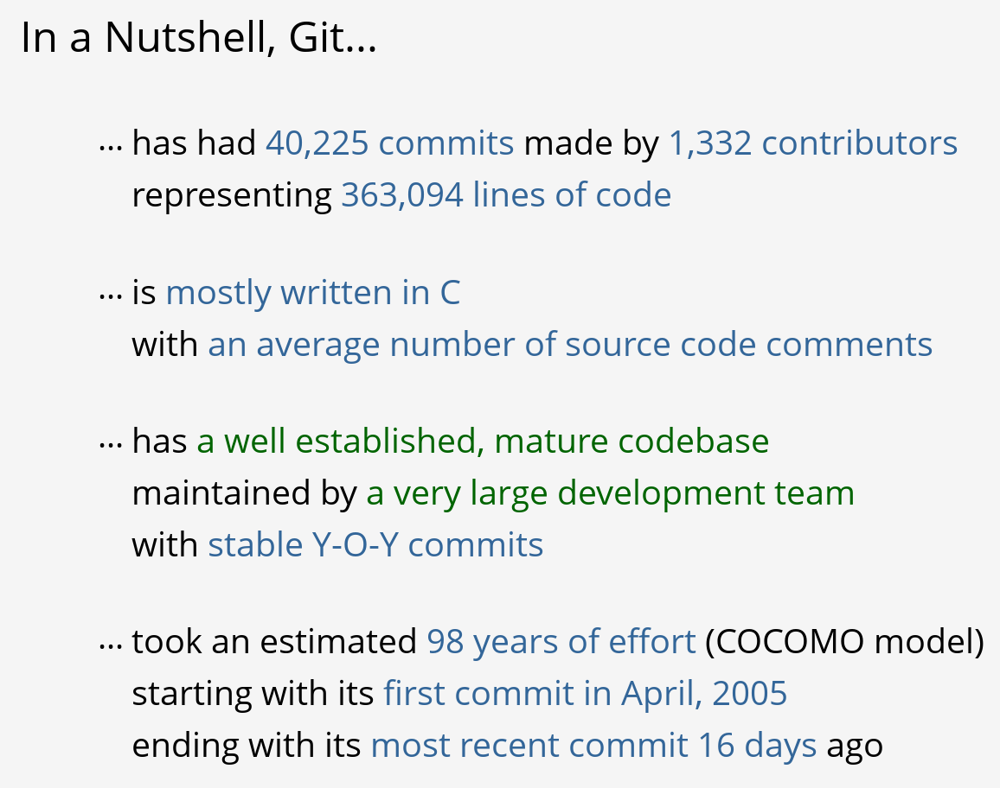
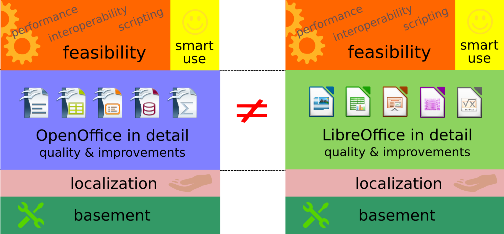
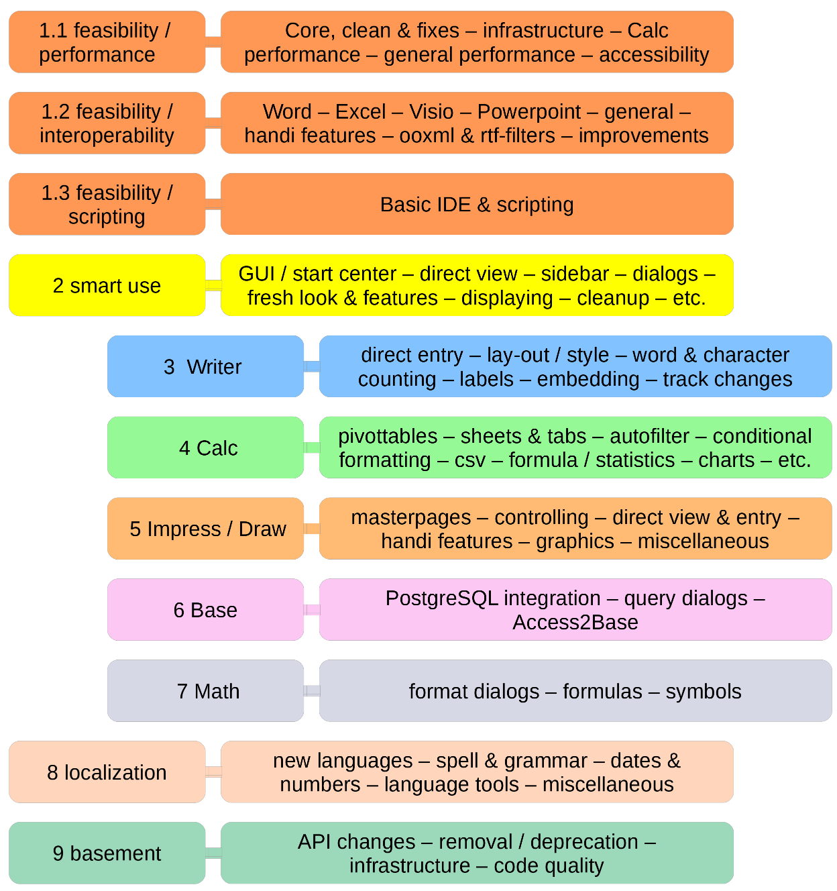
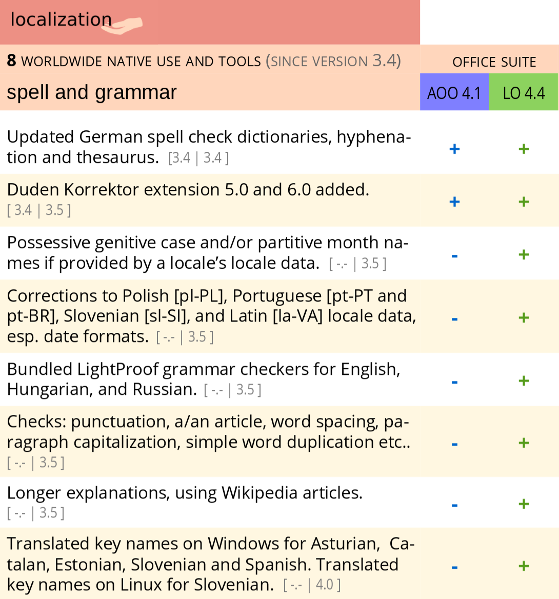

# Before evaluating

In this chapter we deal with some preliminary issues, then describe how to evaluate specific aspects of FOSS products and projects.

## Steps in evaluation

Most evaluation methods follow the following steps:

* Conduct market research to decide which products or projects to evaluate.
* Define the evaluation criteria.
* Perform the actual evaluation, producing the evaluation results.

You can perform the first two in any order. Both lead to the actual evaluation. In some cases, the process is iterative:

* you select some subjects and evaluate them according to certain criteria
* based on the results, you refine the criteria and redefine the list of subjects
* you perform a new evaluation, which leads to more precise criteria and subjects, until you obtain enough data for a final decision

### Market research

Before starting the actual evaluation, define the set of subjects to evaluate. This calls for extensive research on the potential subjects. This research is not only a matter of identifying all your options. It would desirable to find all the products or projects that could be the most appropriate, but this is usually impractical. A more cost-effective approach is to perform extensive market research, then follow some criteria to produce a short list for evaluation.

The length of this list will depend on the resources available for the evaluation, the cost per subject of that evaluation, and the expected benefits.

In some cases the subjects are already decided beforehand, and you can skip this step. This happens, for example, when a community decides to evaluate itself, or when a company wants to evaluate the products they rely upon to deliver services.

### Defining evaluation criteria

The evaluation criteria will determine the information to be obtained after the evaluation process. It is important to tie those criteria to the evaluation's objectives. Make this relationship explicit. One way is to start out by clearly stating the objectives; map them to specific characteristics of the evaluation subject; and, finally, define a procedure to evaluate those characteristics. Evaluating some products in order to select the most mature one is different from choosing the product that has improved most over a long period.

Mapping objectives to characteristics is not easy, because it is not always obvious which characteristics will have a greater impact on the objectives. For example, if the objective is to select a project whose community is easy to join, which characteristics would you evaluate? The length of time it takes for newcomers to reach the core development team, perhaps? The number of contributions already performed by newcomers? The details of formal policies encouraging newcomer participation? The friendliness of conversations in mailing lists and forums in which newcomers participate?

To map objectives to characteristics, you need to use a model of how the latter led to the former. Models can range from informal, simple, andrule-of-thumb to formal, theory-backed, and empirically-tested ones. In any case, expertise on how characteristics of projects and products may influence the objectives is essential.

Defining procedures for evaluating characteristics can also be tricky. You need to know what can be evaluated, and how you can apply that knowledge to the characteristics of interest.

It's uncommon to find an exact evaluation of your characteristic of choice. For example, how can you characterize expertise in a development community? At least two dimensions are involved: the expertise of individuals, and how that expertise permeates the community so that newcomers can capitalize upon it. Both dimensions are difficult to evaluate. You usually need to relay on proxies, such as the average length of time developers remain in the community, and how experienced people collaborate with newcomers to solve issues and make decisions.

For all these reasons, it's hard to start from scratch when evaluating. It is much better to find an evaluation model that fits our needs, and just map it to our specific objectives. A large part of this text will describe some existing models that you will hopefully find useful.

In addition, it is convenient to explain how these models can be produced in systematic way. For that we will introduce the goal-question-metric (GQM) method in a [later section](#sec:gqm). It will serve both as an illustration of how models can be produced, and as a tool to produce new models. You can use GQM not only to derive your own models, if you have the expertise and resources, but also to adapt existing ones to your specific environment. 

### Performing an evaluation

Once the characteristics to evaluate are clear, and the methods to evaluate them too, you can start the actual evaluation. Depending on how you defined the evaluation methods, several actions may be performed, such as:

* Surveys, for example to know about perceived quality by users, or about effort estimation of their own work by developers. 
* Interviews with experts, for example to know about how mature a certain product is considered.
* Study of documentation, to learn about how a product interoperates with others, and to which extent that is described.
* Analysis of source code, to characterize some quality parameters.
* Analysis of messages in mailing lists, to characterize the flow of information in the project.
* Study of the project bylaws, to determine how formal decisions are taken.

These are just examples: many other actions are possible. But whatever the case, with the information gathered from those actions, the evaluation is performed.

### Evaluation results

Depending on the objectives of the evaluation, one of three kinds of resulting information are provided in most evaluation models:

* Tags. These are binary valued parameters that result of evaluation. For example, for a certain definition of "mature", a project may be defined as "mature" or "not mature".
* Scales. Parameters with values that are numbers or elements from a finite set. For example, an scale can be defined as from 0 to 100, trying to show how close to "100%" is the value. For example, a parameter "closed-bugs" could be "78%", meaning that of all bugs reported during a certain period, 78% were closed. Or with a real or integer number. For example, "median of time to close" can be defined to be "178", meaning that the median of time to close a certain set of tickets is 178 hours. Or with values in a set of strings. For example, "maturity" could have values in the set "mature", "close to maturity", "inmature".
* Metadata. This is usually detailed information about the parameter, from which usually either scales or tags can be produced. For example, detailed metadata for a parameter could be a list of its main statistics, or even a complete list of all its values. That way, from detailed metadata on "time to close" consisting on the time to close all tickets, the above mentioned scale "median of time to close" could be inferred.

In addition, free text evaluation can be useful as well, such as the detailed analysis by an expert.

A very specific case of free text evaluation are factoids. Factoids are predefined pieces of text that describe with natural language some quantitative situation. They are selected based on the results of the quantitative evaluation, but have the appearance of free text. To some extent, they can be better for novices, since they provide an explanation in "common words" of the tags, numbers or scales. 

*Factoids shown by OpenHub for the git project, circa June 2015*

We can classify the results of the evaluation process in two categories:

* Quantitative evaluations. They produce a quantitative description of the evaluated characteristic. Tags, scales and metadata are cases of quantitative evaluation.
* Qualitative evaluations. They produce a description of the quality of the evaluated characteristic. Free text evaluations produced by an expert are an example of qualitative evaluations.

Qualitative evaluations can be converted into quantitative ones by using the descriptions to select from a scale of valuers. That allows for easier comparison, but usually some information is lost, the kind of shadows and details that qualitative descriptions provide.

Quantitative evaluations can be converted in qualitative by producing the alreaready mentioned, predetermined "factoids". That allows for easier interpretation, but it is convenient to remember that those are "syntetized" qualities: the underlying information is quantitative, and the derived factoids are just descriptions of those quantities.

NOTE: TODO. Example of both conversions

## Goal-question-metric

The baseline rationale of the goal-question-matric GQM metric for deteriming the characteristics of subjects to evaluate, and how to evaluate them can be summarized as follows:

> "The Goal Question Metric (GQM) approach is based upon the assumption that for an organization to measure in a purposeful way it must first specify the goals for 
itself and its projects, then it must trace those goals to the data that are intended to define those 
goals operationally, and finally provide a framework for interpreting the data with respect to the stated goals."

> [The Goal Question Metric Approach](bib:basili-gqm).

In other words, you first have to state the goals of the evaluation. Then, you have to map those goals to characteristics of the subject of evaluation, and how they are going to be evaluated. Finally, you have to find out how to interpret the results of the evaluation with respect to the intended objectives.

Using the terms proposed by GQM, you have to define:

* Goals, at the conceptual level.
* Questions, at the operational level.
* Metrics, at the quantitative level.

### Definition of goals

### Definition of questions

### Definition of metrics

## What is different in FOSS evaluation

Evaluation of FOSS products is different for the following reasons:

* The easy access to the product to evaluate.
* The quantity and quality of available information
* The importance of the community
* The special case of open devlopment
* The competing market for deep support

### Access to the product

In the case of non-FOSS, the first barrier to evaluate is the access to the product. For FOSS, the evaluator is usually one download away from evaluating any FOSS product which is adequately packaged. For non-FOSS, just accessing may mean signing a contract, paying for a regular non-exclusive license, or obtaining a usually limited evaluation version.

This means that with FOSS, evaluating the real thing promplty, to any detail, withouth strings of any kind attached is much more simple.

### Available information

For FOSS products, not only the exectuable version of the software is availalble. Per definition, source code is available as well, which allows for its inspection, and the evaluation of aspects of quality that need access to it, such as code quality.

For some non-FOSS, source code may be available, either for all potential users or for those with a certain negotiation power. But it is a rare event.

In addition, if the development model is open, the development information for the FOSS product is kept avaible to anyone with the devloping community. Even when a single company drives the development of a FOSS product, they may decide to run all development in the open. When it is produced by a community, the rule is that the development information is available.

Therefore, the evaluation by third parties of the development processes is possible in the case of FOSS using open development models.

TBD: repositories where the information about development is available.

## Community

Development and user communities are usually key factors for FOSS products. Healthy development communities ensure the future survivability of the product even better than strong companies. Large, involved user communites ensure the needed pressure to keep the product in the leading edge.

Therefore, the evaluatilon of communities is of great importance in the case of FOSS.

## Open development

Some FOSS projects are developed "behind the curtains", not different from traditional projects. For those, little or no infornmation about the development process is available. But fortunately, these projects are the exception in the FOSS world. The usual case is that an open development model is used.

A simple definition of open development is:

> Open development is an emerging term used to describe the community-led development model found within many successful free and open source software projects.

> [Avoiding abandon-ware: getting to grips with the open development method](bib:anderson-avoiding), by Paul Anderson

That kind of development, because of its very nature, usually provides publicly a lot of information about the internals of their development processes. That allows for an evaluation of those processes, something that is impossible in the traditional, closed development cases.

## Competing market

The existence of a competing market, with many providers of in-depth support, independent of each other, is possible in the case of FOSS. In the case of non-FOSS, due to the strict control granted by maintaining all copyright rights, only companies in agreement with the producer can provide this kind of services, and therefore no real competing market exists.

In the case of FOSS, that market can exist. But it does not always exists. In fact, for many FOSS products no specific provider of in-depth support can be found. This is the case for most volunteer-driven and in-house projects, when an organization develops the software for its interenal needs. In both cases, until there is enough commercial use of the software, there is no demand for commercial support. Unfortunately, this means that new commercial actors interested in using the software will have more difficulty in doing so, for the very reason they cannot find support.

TBD: Generic support companies can be useful here. Detail the case of a single-provider. 

TBD: importance of evaluating if such a competing market existis or not, and how it is.

## The importance of transparency

Free, open source software communities are a matter of trust. All participants want to feel that the rules of the community are fair, and that everyone is considered on the value of their contributions, with no bias due other factors. For that, it is very important that the information about what happens in the community is transparent, and available to anyone. This is one of the main reasons for adopting open development models in FOSS communities.

But having the data available is not enough. Specially in large projects, the community needs some means to understand what is happening. The quantity of data may be really large, and it is not easy to extract from it useful information. Therefore, transparency is not only providing the data, but providing the data in a way that it is useful for the community, in a way that helps it to understand what's happening at several levels of detail.

### The many facets of transparency

## Criteria for evaluation

* Intangible factors
* Risk
* Functionality
* ...

## Evaluation of functionality

This is one of the more commons evaluations when selecting tools, either to use or to integrate with others. Usually, this is done in the context of a product acquisition procedure, and considers mainly compliance with requirements, quality, and adaption to certain needs. The evaluation can be used to balance against cost, or to select among products that could fit the requirements.

Most of this evaluation is not different for FOSS and non-FOSS programas. Only the easy of access to the elements to evaluate make a difference. In the case of FOSS, source and binary code for the program are easily available for evaluation. Source code may be convenient to understand how a certain feature works, or to better evaluate performance. In some specific cases, such as evaluating security features, the availability of source code allows for deep inspection. But usually we can just use the general functional evaluation models. Therefore, instead of entering into details we will just sketch how functional evaluation can be done, illustrating with an example. This example is [Comparing LibreOffice with Apache OpenOffice](bib:jonkers-nouws-comparing-lo-aoo), a comparative functional evaluation of both products.

The evaluation starts by defining a model of the product to evaluate, and a grouping of its more relevant characteristics. The next picture shows a functional model of the LibreOffice and Apahe OpenOffice case.

*Commparing LibreOffice and Apache OpenOffice: functional model. All the evaluation in the report is based on this model.*

The functional model defines the main functional components of the software to evaluate. Now, we can define functional features of relevance, and evaluate each of them. The evaluation can be quantitative or qualitative. In the former case, boolean (the feature is available or not) and fractional (the feature is available to a certain fraction of some "ideal" feature) evaluations can be performed. For example, a certain feature can be present in a product, or "80% present" with respect to some ideal feature. In the latter case, an expert provides a detailed description of each feature. In many cases, both evaluations can be present, since both can be relevant.

In the case of the comparison of LibreOffice and Apache OpenOffice, the next picture shows the main relevant features for evaluation, grouped according to the modules defined in the functional model.

*Comparing LibreOffice and Apache OpenOffice: identification of relevant features*

Which are later refined in specific features, which are evaluated to be present or not ("+" or "-" in the next figure). In this case, the functionality is related to the corresponding changes in the source code during a certain period. But this is not necessarily the case. A very similar evaluation can be performed just by defining functional aspects and then verifying if they are present or not in a certain product.

*Comparing LibreOffice and Apache OpenOffice: evaluation of features*

This information can be later used to produce a report on the functionality found, in a comparison between different products, etc.

## Evaluation of suitability

Example: OpenBRR

## Evaluation of quality

Example: QSOS, Qualoss

## Evaluation of maturity

Example: Polarsys Maturity Model

## Evaluation of community and development processes

Example: The Bitergia evaluation

