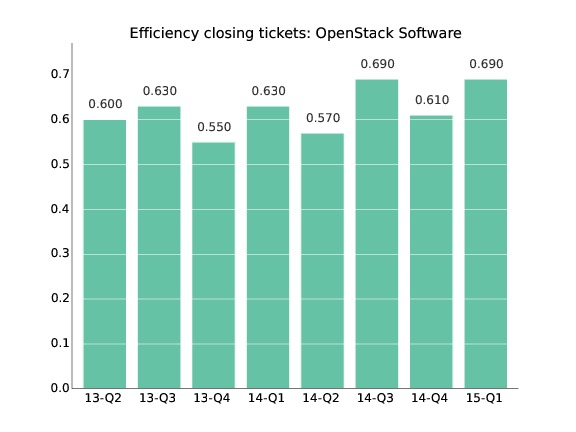
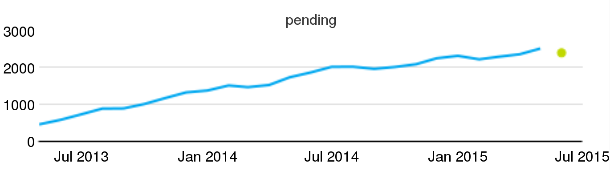
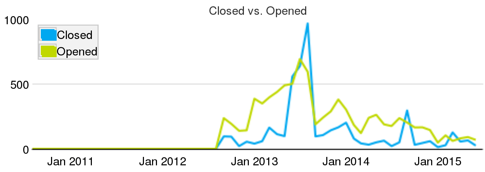
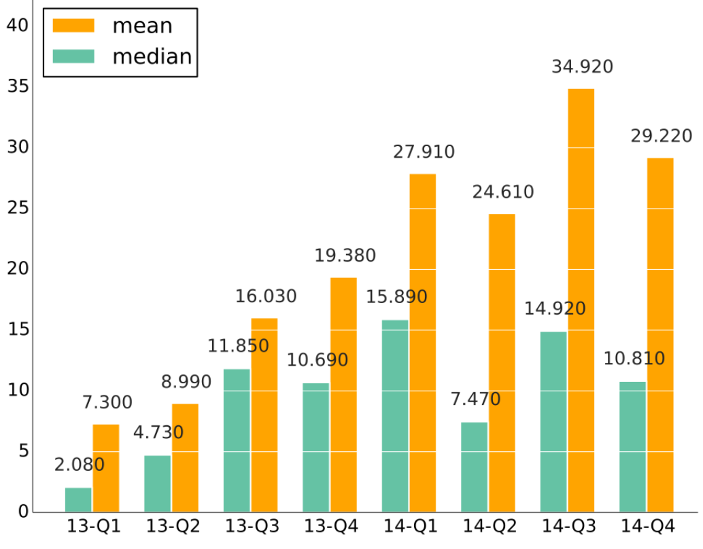

# Evaluating development processes

Processes are fundamental in software development. We can model as processes most actions in development projects, from implementing a new feature, to fixing a bug, or even to make a decision about how to implement a feature. Many of these processes can be tracked using information available in software development repositories.

From this point of view, FOSS projects are not different from any other software development project. But, as we discussed in the case of activity, when the project follows an open development model, most of the information needed to track processes is public. Therefore, any third party can use it to evaluate how those processes are being completed.

## Performance

There are several metrics for evaluating performance in processes. Some of the most useful are:

* Efficiency. Defined as the ratio between finished processes and new (started) processes for a certain period. For example, efficiency in dealing with tickets can be defined as tickets closed / tickets opened per month. Efficiency lower than one means that the project is not coping with new processes: more processes are starting that the project is finishing. Every period that happens, the backlog of open processes will increase. The evolution over time of efficiency allows to understand the long-term trends, and whether a certain efficiency is something temporary, or a permanent trend.


*Example of efficiency: Ratio of closed to opened tickets per quarter for the OpenStack project. From the [OpenStack Community Activity Report, January-March 2015](), by Bitergia.*

* Backlog of open processes. Defined as the number of processes currently open at a certain moment. For example, the backlog of code review processes still in process on a certain date. The backlog of open processes is the workload the project has to deal with, assuming no new workload appears. If the backlog increases, efficiency is lower than one, and the project is not coping with new processes. Of course, other backlogs are possible, for processes in other states different from "open".
 

*Example of backlog: Pending code review processes in Wikimedia projects, evolution per month, circa July 2015.*

* Time to attend. Defined as the time since the moment a process is open, to the time it is first attended by the project. For example, the time to attend a certain bug report. Statistics about time to attend say about how responsive the project is, in regard of providing some early feedback to the initiator of the process. For some cases, this early action on the process may be automatic, performed by a bot. Even when this is still interesting, since in the end the opener gets some feedback, usually it is important when a human is dealing with the process for the first time. 
* Time to finish. Defined as the time since the moment a process is open, to the time it is finished. 

Both for time to attend and time to complete, the mean for a collection of processes is not significant, because the distribution of times is usually very skewed. Medians or quantiles can be more useful to characterize the time to attend for a collection of processes. You can remember what the median and quantiles mean:

> "A collection of processes has a median t of time-to-something if the longest of the 50% of processes with shortest time-to-something is t. In other words, 50% of the processes were shorter than t, and 50% were longest than t."

> "A collection of processes has a 0.95 quantil of time-to-something equal to t if the longest of the 95% of processes with shortest time-to-someting is t. In other words, 95% of the processes were shortest than t, and 5% were longest than t.

You can quickly notice that the median is the 0.5 quantil.

As an example, if the median of time-to-close tickets for a certain month was 23.34 hours, that means that 50% of the tickets were closed in less than 23.34 hours, or than 50% of the tickets took more than 23.34 hours to close.

As another example, if the 0.95 quantil of time-to-review a change is of 4.34 days, that means that 95% of the changes were reviewed in less than 4.34 days, but 5% of the changes were reviewed in more than 4.34 days.

You should notice as well that you can only measure time-to-X if X already happened. For example, time-to-close can only be measured for a ticket if it was already closed. Otherwise, you can only know that time-to-close will be longer than the time it has been open up to now, but nothing else. This is important, because it can cause counter-intuitive situations.

Assume for example a project with 100 still open tickets and 50 already closed tickets. All 50 closed tickets had a time-to-close of 2 days. All the 100 open tickets were open 60 days ago. If we measure the median of time-to-close now, it will be of 2 days, since it only applies to closed tickets. Now, the 100 still open tickets are closed during today. At the end of the day, we have 50 tickets with 2 days of time-to-close, and 100 with 60 days of time-to-close. That is, our median of time-to-close raised to 60 days, even when we closed a lot of old tickets. In other words, closing a lot of tickets raised time-to-close, which could be interpreted as a decrease in performance, when it is exaclty the other way around.

To avoid this effects, there are some other metrics, such as:

* time-active. It is defined as time since the process started, only for processes which still didn't finish. In some sense, it is a complement to time-to-finish: while time-to-finish considers only finished processes, time-active provides a similar information, but only for processes still open.

In the former example, time-active before closing the old 100 tickets would be 100 days foro all tickets to consider (those still open). After closing those 100 tickets, there are no tickets to calculate time-active, since all of them are closed.

* time-open. It is defined as time-to-close for processes already closed, and time-active (time since opened) for processes still open.

In the former example, time-open before closing the old 100 tickets would be of 2 days for the closed tickets, and of 60 days for still open tickets. That would be a median of 60 days. After closing the tickets, it would still be of 2 and 60 days, now keeping the median in 60 days, which at least remains constant.

* aggregated-time-open. It is defined as the sum of time-open for all tickets.

In the former example, before closing the tickets aggregated-time-open is of

```text
   50 x 2 + 100 x 60 = 6100 days
```

* aggregated-time-open-diff. We define this as the difference with the previous time-open for all tickets. This allows us to have a comparison about how aggregated-time-open varies over time, if it is measured periodically.

exactly as it will be after closing the 100 old tickets. This allows for a monotonic metric, which produces more intuitive results.

### Example: regular and burst processes

Another example can illustrate a different scenario. Assume now that a project is opening 3 processes every day, and is closing them after two days (at the end of the second day). Metrics will be evaluated at the end of each day. In this case, metrics will evolve as follows:

|Day|New|Finished|Open|Closed|TTF (median)|TA (median)|TO (median)|ATO | ATOD |
|---|---|--------|----|------|------------|-----------|-----------|----|------|
| 1 | 3 | 0      | 3  | 0    | N/A        | 1         | 1         | 3  | N/A  |
| 2 | 3 | 3      | 3  | 3    | 2          | 1         | 1.5       | 9  | 6    |
| 3 | 3 | 3      | 3  | 6    | 2          | 1         | 2         | 15 | 6    |
| 4 | 3 | 3      | 3  | 9    | 2          | 1         | 2         | 21 | 6    |
*Table describing an scenario of a project opening and closing processes. Each row represents a day. New: number of new processes open during the day. Finished: number of processes finished during the day. Open: number of processes still open at the end of the day (this is the backlog of still open processes). Closed: number of processes already closed at the end of the day. TTF: time-to-finish (or time-to-close) for all closed processes at the end of the day. TA: time-active, for open processes. TO: time-open, for open and closed processes, at the end of the day. ATO: aggregrated-time-open at the end of the day. ATOD: aggregated-time-open-diff at the end of the day. For simplicity, we assume that new processes start at the beginning of the day, and finished processes finish at the end of the day. All times are in days.*

The median for time-to-finish quickly moves from N/A to 2 once the project starts to finish processes, and remain there since the time it takes to close tickets is constant. Time-active remains stable at 1, since at the end of the day, the processes from yesterday were closed, and only those opened when the day started are still active. Time-open reflects a bit more closely what is happening in days 1, 2, and 3, moving from 1 to 2 as more new processes start. Aggregated-time-open-diff shows the regularity of the system as well.

Now, let's see how the metrics reflect a peak in new processes. Let's assume that on day 5, in addition to the 3 new processes that are finished in two days, 10 new processes start, and they are not finished during the following days.

|Day|New|Finished|Open|Closed|TTF (median)|TA (median)|TO (median)|ATO | ATOD |
|---|---|--------|----|------|------------|-----------|-----------|----|------|
| 5 | 13| 3      | 13 | 12   | 2          | 1         | 1         | 37 | 16   |
| 6 | 3 | 3      | 13 | 15   | 2          | 2         | 2         | 53 | 16   |
| 7 | 3 | 3      | 13 | 18   | 2          | 3         | 2         | 69 | 16   |

On day 5, we have 13 new processes: the 3 "regular" ones, and that peak of 10 more. At the end of the day, we have closed the 3 processes that started on day 4. This means that 13 processes (all that started during the day) remain open at the end of the day. We have a total of 12 closed processes (we had 9 on day 4, plus three more we finished today). The median for time-to-finish remains at 2, since all closed processes took 2 days to finish. All processes still open were opened at the beginning of the day, therefore time-active is 1 for all of them, and the median too. The median for time-open, on the contrary, and maybe surprisingly, went down to 1. The accounting is as follows: 12 closed processes took 2 days to finish, while 13 open processes have been open for one day. Therefore, more than 50% of the process have a time-open of 1 day. Aggregated-time-open rose to 37: it was 21, plus 3 more days for the processes finished during the day, plus 13 more days for the new processes that started today. Aggregated-time-open-diff rose to 16 days (37 - 21).

On day 6, we have only three new "regular" processes, and we finish the three "regulars" that started on day 5. That means that the number of processes still open at the end of the day remains at 13, since none of the 10 "extra" processes that started on day 5 finished. The number of closed processes is rises to 15, with the 3 from day 5 that were finished. Time-to-finish remains at 2, since still all finished processes took 2 days to finish. Time-open now rises to 2, with the following accounting: 15 closed processes took 2 days to finish; 10 processes that started on day 5 have been open for 2 days; 3 processes open today were open for 1 day. In short: for 25 processes time-open is 2, for 3 it is 1. Therefore, the median is 2. With respect to time-active, for the three projects opened at the beginning of the day, it is 1, and 2 for the 10 projects opened on day 5. Therefore the median of time-active is 2. From all this accounting it is clear that aggregated-time-open is 53, and aggregated-time-open-diff is 16.

On day 7, new, finished and open remains as on day 6, since only 3 "regular" new processes start. Closed processes are increased with the 3 that are closed today. Time-to-finish remains at 2. We have 13 open processes, being 10 of them 3 days old, and three 1 day old: median is therefore 3. Time-open is calculated as follows: 18 processes took two days to close, 10 processes were open for 3 days, 3 processes were open for 1 day. Therefore, the median of time-open remains at 2. From these numbers, aggregated-time-open is 36 + 30 + 3, that is 69. Aggregated-time-open-diff is 16 once again.

From this scenario, we can learn several lessons. Time-to-finish does not reflect new processes that are still not finished. They can last for long periods, but will not be reflected in time-to-finish until they are finished. That means that time-to-finish can grow quickly when old processes are finalized, which is natural as we defined the metric, but is maybe not what some people expect when consider a longer time-to-finish as a worse metric, when comparing. Time-active, meanwhile, reflects how old processes still active age, but completely ignore (by design) how long it took to close processes.

Another lesson is that time-open can be masked by a large population of closed processes. In the example, assuming the pattern of new processes includes only "regular" processes, the median for time-open will remain at 2, even when a large amount of open tickets are unattended.

Aggregated-time-open and specially aggregated-time-open-diff reflect much better what is happening. Aggregated-time-open-diff, in particular shows how we have a continuous "lag" in dealing with processes, those 16 days of "increase" every day. That metric rose immediately when new processes entered, and will only go down when they are finished. It reflects to some extent the "amount of work still open".

### Metrics for periods, metrics for snapshots

To better understand how the above metrics evolve over time, it is important to consider how exactly they are defined when we want periodic samples of them. The key is characterizing the collection of processes used to calculate the metric. In short, some metrics are defined for collections corresponding to periods, and some others are defined for collections fulfilling some property in given snapshots (cuts in time). Depending on whether they are defined on periods or on snapshots, they behave differently.

Efficiency and time-to metrics are defined on collections of processes defined over periods. Backlog is defined on collections of processes defined on a point in time, a "snapshot" of the processes. Since snapshots are easier to understand, let's start explaining them.

When we want to analyze the evolution of the backlog over time, we define the sampling rate (say, once per week), and the starting point for the time series (say, January 1st at 00:01). What we do after that is to measure the backlog at the given points in time, by selecting the collection of open processes (if this is the backlog of open processes), and counting it:

|Snapshot        |Collection    |Number|
|----------------|--------------|------|
|2015-01-01 00:01|Processes open| 34   |
|2015-01-08 00:01|Processes open| 23   |
|2015-01-15 00:01|Processes open| 37   |
|2015-01-22 00:01|Processes open| 46   |
|2015-01-29 00:01|Processes open| 51   |

Collections based on periods are a bit trickier. If we consider for example efficiency, it is defined as the ratio of opened to closed processes. For comparing how the system is evolving over time, we need to define comparable collections of processes as time passes. But it is not useful to define those collections as "opened processes" and "closed processes" at some snapshots. The reason is clear: at a certain point in time, the collection will contain usually zero, or maybe one (if it was exactly opened or closed at that point in time) process. Which doesn't make sense for studying the evolution.

To avoid this problem, we define collections on periods. For example, all tickets opened during the first week of the year, and all tickets closed during the first week of the year.

But periods are not "points on time", and therefore we have to be careful on how we define them. If they are too short, they are going to capture too many occasional effects, and periods are going to be difficult to compare. But if they are too large, they are going to miss seasonal effects, masked by the "mean behavior".

If they are not homogeneous enough, they can be misleading. Consider for example two consecutive periods of 10 days each, but one capturing one weekend (Tuesday 7 to Friday 16), and the second one capturing two (Saturday 17 to Sunday 26). If processes are affected by lower activity during weekends, as is usually the case, the second period will appear less active when in fact maybe it is not, considering the seasonal effect of weekends. There are statistical tools that help with these effects, but a good selection of periods can minimize this effect. Days, weeks, months, quarters of years are usually good periods, when the granularity is good enough for the kind of process being analyzed.

Another effect to have into account is which processes we consider as being included in the period collection. For example, if we are measuring opened versus closed tickets for a given month, say January 2015, we can consider processes closed during that month, or processes closed at any point in time, but opened during that month. The first definition provides information on how the project is performing during a month, in terms of finished work (processes closed) versus new work (processes opened). The second definition provides information about how much work that started that month was already completed. Both are interesting, but both are very different.

Because of these reasons, it is important not only a careful selection of the period, and inclusion criteria for deciding the collections corresponding to the period. It is important as well to define carefully which processes are interesting to select, according to what is interesting to measure. 

### Some remarks about performance in finishing processes

In the end, when you are interested in performance in finishing processes, you should consider both the backlog and some statistics (usually the median or some quantile) of time-to-finish or time-open. The backlog will tell you about how much work is pending. The time-to-close about how long did it take to finish the processes.

All these metrics have to be considered in the context of activity. This applies specially to efficiency and backlog, but affect other metrics too. For example, in the context of a project where activity is growing quickly, it is relatively normal that efficiency is less than one, but still the project is healthy in the long term. When activity is growing quickly, usually the project is receiving more resources, and its community is growing accordingly.

But allocating new effort to deal with processes may take some time, while the growth in activity is directly linked to the opening of new processes. Therefore, it is usual that there is a certain lag between needs to close processes, and new people dealing with them. As the project stabilizes, it will start to create new processes more slowly, efficiency will increase, and backlog will start to decrease.

### New features, bug fixing and code review

Among the tickets in the ITS, most issues deal usually with either feature requests or bug fixes. In fact, many projects require that the process towards any change in the code, either to fix a bug or to implement some new functionality, start with filing a ticket.

In the case of new features, the person starting the process may be a developer, and in that case we usually talk about a proposed feature. But it can be a user as well, and then it becomes a feature request. Both developers and users file report bugs by opening a bug report ticket.

From a traditional software engineering point of view, telling features from fixes may be considered important. This is because they signal two different activities: "real" development, when adding new functionality, or maintenance, when fixing bugs. In traditional environments this could be done at different stages in time, and even by different teams with primary responsibilities either in producing the next release (development) or in fixing problems with past releases (maintenance). In many modern projects, specially when they are using continuous release practices, this difference is less important.

From a practical point of view, be it interesting or not, there are practical problems for doing specific analysis for features or bugs. The main one is how to tell feature requests and proposed features from bug fixes. In some cases, the ITS provides a flag to make a difference, but even in thoses cases, it is only an indication that the ticket could be referring to a feature or a bug. On one side, bug fixing can evolve to feature implementation, and the other way around. On the other, it is not always easy to decide if a certain activity is improving the system by adding some missing functionality, or fixing a bug.

Consider for example the case of o form not working properly when using a touchpad. Solving it can be understood as fixing a bug (the form should work always, and it was not working in certain circumstances) or as implementing a new feature (support for touchpad). When you can match against a detailed list of requirements, this could be solved by deciding if the form was intended to work with touchpads or not, and then classify the action as a fix or as new functionality (by adding a new requirement). But most FOSS projects are not that formal, and even when they are, this is in many cases a matter of how requirements are interpreted.

To complicate matters further, in some projects there are more activities being carried on in the ITS. Those can include discussions on requirements, on the policies of the project, or requests related to the use of the development infrastructure.

And still a step beyond in making things difficult for the analyst, some projects use the ticketing system for code review. This has been a natural evolution, when specialized code review systems didn't exist. In fact, writting comments with opinions on a patch linked to a ticket, or to a commit that closed a ticket, are two examples of coded review which can be found in many projects, even when code review was not formally adopted by them. When some projects decided to adopt formal code review procedures, they started by using what they had handy: the ITS. That's how projects such as WebKit defined workflows in the ITS (Bugzilla in their case) to deal with code review. Other projects used workflows defined on Jira.

With time, specialized systems such as Gerrit emerged. Even when they are focused on code review, they still use a model quite similar to ticketing systems, with each code review cycle being modeled as a ticket. Other systems, such as GitHub pull requests, are even closer to tickets, to the point that the interface they offer is almost the same.

New features are usually found as a kind of tickets in the ITS. But they are not always easy to tell from other tickets, such as bug reports. In some ITS, feature requests are marked as such. But in others only some heuristics can be applied on the description of the ticket or in the comments to it. 

### Bug fixing

As was said when commenting on feature requests, bug reports live too in the ITS of the project. But again as was the case with feature requests, it is not always easy to tell them apart from other tickets.


### Code review


## Workflow patterns

Projects use different workflows to deal with processes. In many cases, even they can have specific policies, such as defining allowed state transitions to deal with tickets, or review patterns to deal with proposals of change to the source code. When the different states and transitions are recorded in some development repository, the complete process can be tracked. This allows for the analysis of the real workflows, and their compliance with good practices or project policies. In addition, time between transitions can be measured, to detect bottlenecks and compute time for different workflows.

### Example: code review

In code review, the workflow can be divided between two stated: waiting for review and waiting for new change proposals.

### Example: tickets


## Participation

We can also analyze who participated in specific processes in a project. From that point on, we can assess on several dimensions, discussed in sections below, such as diversity in participation or neutrality.

### Ticket closing

Closing tickets usually means workflows moving through a complex collection of states.

Some of the states may imply dependencies on communication with users, or on external projects fixing some issue. Therefore, the detailed analysis of state changes can also be used to attribute delays to developers, to users, or to external projects.

In any case, once we know which tickets correspond to new features, some of the metrics that we can define on them are:

* Time to attend: Up to the moment there is some comment by a developer, usually commenting on the feasibility of the request, and maybe assigning to a developer for implementation.
* Time to first patch: Up to the moment a patch implementing the feature is produced.
* Time to final patch: Up to the moment a patch lands in the code base intended for the next stable release. In some cases, this is equal to time to first patch, because there is no further process once the patch is produced. But in others, code review or automatic testing is in the middle of landing into the code base.
* Time to release: Up to the moment the patch is included in a public release. If the system is following a continuous release policy, this can be exactly equal to time to final patch. But when point releases are produced at discrete moments, this time can be considerably longer.
* Time to deployment: Up to the moment the patch is deployed into production systems. In many cases, the FOSS project doesn't have a direct reference to this moment, since it happens downstream, in the institutions using the software.

Ratios between new feature requests and final patches or released patches are interesting to evaluate the performance of the project in terms of how much it is coping with new requests.

In any case, the metrics discussed for new features can be applied to bug fixes too. There are some other intersting metrics as well:

* Reopenend bug reports. Those tickets that after being considered closed, because it seemed that the bug was fixed, have to be reopened because it was not fixed at all.
* Ratio of reopened to closed. Give an idea of how effective is the bug fixing process. If the ratio is high, that means that many bugs are assummed to be fixed when they are not, and therefore have to be reopened.

Because of the difficulty of differentiating between feature requests and bug reports, in many cases it is useful to obtain the metrics for all tickets together.


*Evolution of closed and open tickets per month for the Apache Cloudstack project circa July 2015*

For example, the chart above shows the evolution of closed and opened tickets per month for a FOSS project. In this case, it can be observed how the number of opened tickets is larger than closed tickets almost for every month. This situation, which is very common in real projects, means that every month the project is not coping with all the new work they have. From time to time, the project can run "closing parties", or use bots just to close old bugs that are never going to be fixed, and maybe are no longer bugs. The blue spike in Summer 2013 could be one of such cases.

### Code review

Most of the metrics used for issue tracking systems (either bug fixes or feature requests) can be applied to code review, if we consider the submission of the patch to review as the starting point of the metric. Therefore, we have:

* Time to attention: Up to the moment a reviewer starts taking action on the code review system.
* Time to review: Up to the moment reviewers take a decision on the review of the code, such are accepting it, or requesting some changes from the submitter.
* Time to new submission: From the moment some changes were requested by reviewers, to the moment a new patch is sent.
* Time to merge: From the moment a code review process starts, to the moment the corresponding change lands in the code base.


*evolution of time to merge in Nova (an OpenStack subproject), by quarter, during 2013 and 2014.*

Based on these times, aggregated times for each review process can be computed:

* Reviewer time: Aggregated periods while the submitter is waiting for review by reviewers. This metric captures the amount of delay in the process which is under the responsibility of reviewers.
* Submitter time: Aggregated periods while reviewers are waiting for a new submission. This metric captures the amount of delay which is under the responsibility of submitters.

Therefore, a long time to review may be due to a long reviewer or submitter time. The problems the project is facing in both cases, and the means to solve them, are very different.

Not only time is interesting:

* Number of review cycles: Number of reviews (from submission of a change to acceptance or request for a new change) that are needed to finish a review process.

In addition, metrics about the effectiveness of the code review process are useful too. For example:

* Ratio of abandoned to merged changes. Gives an idea about how many of the submitted proposals for change end nowhere, with respect to how many end in the code base. 
* Ratio of merged to submitted changes. This is a kind of a success ratio, showing how many review processes finish with a change in the code base with respect to how many were started.

### Mailing lists


## Interaction with users

Communication channels can be used by users to solve problems or report them. This interaction can be monitored in several repositories. In our experience, this can be done mainly on both ticketing and asynchronous communication systems. From those, it can be known:

* Who asks for help, or in general comments on issues related to the project.
* Who participates in solving those issues.
* Who of those who participate are developers.

## Diversity in participation

There are several aspects about participation in processes where diversity has a role:

* Participation from diverse time zones in specific process, which may help to speed the process up, or to slow it down, depending on how is that participation.
* Participation by diverse companies.

## Neutrality
